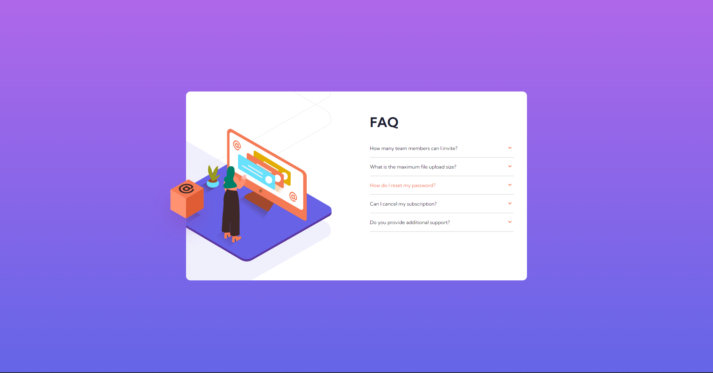
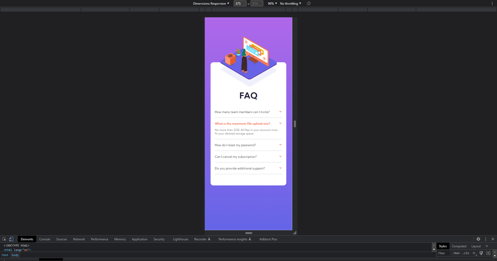

# Frontend Mentor - FAQ accordion card solution

This is a solution to the [FAQ accordion card challenge on Frontend Mentor](https://www.frontendmentor.io/challenges/faq-accordion-card-XlyjD0Oam). Frontend Mentor challenges help you improve your coding skills by building realistic projects. 

## Table of contents

- [Overview](#overview)
  - [The challenge](#the-challenge)
  - [Screenshot](#screenshot)
  - [Links](#links)
- [My process](#my-process)
  - [Built with](#built-with)
  - [What I learned](#what-i-learned)
  - [Continued development](#continued-development)
  - [Useful resources](#useful-resources)
- [Author](#author)

## Overview

### The challenge

Users should be able to:

- View the optimal layout for the component depending on their device's screen size
- See hover states for all interactive elements on the page
- Hide/Show the answer to a question when the question is clicked

### Screenshot

Desktop:


Desktop active:



Desktop open option:


Mobile:




### Links

- Solution URL: [FrontendMentor.io](https://www.frontendmentor.io/solutions/faq-accordion-card-made-with-js-grid-and-position-absolute-y-o-LfGzFf)
- Live Site URL: [GitHub Pages](https://markvanweersch.github.io/faq-accordion-card/)

## My process

### Built with

- Semantic HTML5 markup
- CSS custom properties
- Flexbox
- CSS Grid
- JavaScript
- CSS position absolute

### What I learned

How to build an accordion using JavaScript. At first I made this with an "if else statement", checking if the display value was equal to block or not. I later changed this to a classList.toggle to toggle two classes. One for the unfold and one for making the question bold.

Also to pay attention to the images used within the project. For this one there are different images for desktop and mobile, which I only noticed towards the end of the project. Making it a bit of work to get them in the right place again. The HTML and CSS can be better organized that it is right now.

This the code for the accordion:

```js
window.onload = onLoad;

function onLoad() {
  const questions = document.querySelectorAll(".question");
  console.log(questions);

  for (let i = 0; i < questions.length; i++) {
    questions[i].addEventListener("click", openQuestion);
  }

  function openQuestion(event) {
    let parent = event.target.parentElement;

    let answer = parent.querySelector("p");
    answer.classList.toggle("hidden");

    let title = parent.querySelector("h2");
    title.classList.toggle("bold");
  }
}
```

### Continued development

I want to continue focusing on developing my JavaScript skills. This is the firs JS code I wrote in a challenge.

### Useful resources

- [JavaScript & jQuery](https://www.vanduurenmedia.nl/EAN/9789463561396/Handboek_JavaScript_en_jQuery_3e_editie) - This book really helped me get started with JavaScript.

## Author

- Website - [Mark Vanweersch](https://markvanweersch.github.io/)
- Frontend Mentor - [@MarkVanweersch](https://www.frontendmentor.io/profile/MarkVanweersch)